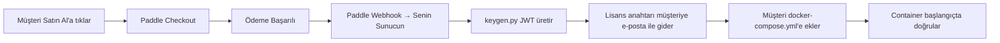

# CorvusTunnel Ticarileştirme Planı

> Yan projeden gelir getiren bir ürüne geçiş için eksiksiz yol haritası.

---

## Yönetici Özeti

| Karar | Seçim |
|---|---|
| **Hedef Pazar** | Tüm segmentler (bireysel geliştiriciler → ekipler → kurumsal) |
| **İş Modeli** | Freemium + Pro ($9/ay veya $90/yıl) |
| **Ödeme İşlemcisi** | Paddle (Merchant of Record — satıcı sıfatıyla) |
| **Tüzel Kişilik** | Şahıs Şirketi → gelir ~₺1M/yıl olunca Ltd. Şti.'ye dönüşüm |
| **Dağıtım** | Docker Hub (public image + lisans anahtarı doğrulama) |
| **Web Sitesi** | Önce landing page, dashboard sonra (sadece İngilizce) |
| **Kaynak Kodu** | Kapalı kaynak (PyArmor ile obfuscate) |
| **Ücretsiz Tier Limitleri** | 30 dk oturum, 10 dk bekleme, günde max 3 oturum |
| **Destek** | Sadece e-posta (support@corvustunnel.com — Cloudflare Email Routing) |
| **Pazarlama** | YouTube demo videoları + Twitter/X |
| **Lansman Takvimi** | 2-3 hafta |

---

## 1. İş Modeli ve Fiyatlandırma

### Tier Yapısı

#### 🆓 Ücretsiz Tier (Lisans Anahtarı Gerektirmez)
- 3 AI agent'ın tamamı (agy, codex, claude)
- **Oturum başına 30 dakika** limit
- **Oturumlar arası 10 dakika** bekleme süresi
- **Günde maksimum 3 oturum** (~90 dk toplam)
- Tüm özelliklere erişim (audit logları, klasör gezgini)
- Terminal başlığında "Powered by CorvusTunnel" filigranı
- Topluluk desteği (self-servis)

#### 💎 Pro Tier — $9/ay veya $90/yıl
- 3 AI agent'ın tamamı
- **Sınırsız oturum süresi**
- **Bekleme süresi yok, günlük limit yok**
- Filigran yok
- E-posta desteği (support@corvustunnel.com)
- Öncelikli hata düzeltmeleri

#### 🏢 Takım Tier — "Bize Ulaşın" (Gelecekte)
- Henüz inşa edilmedi — fiyatlandırma sayfasında sadece link
- Talep ölçmek için "İletişime geçin" butonu
- İçerecekler: çoklu kullanıcı, paylaşımlı audit log, takım yönetimi

### Bu Fiyatlandırma Neden İşe Yarar
- $9/ay, AI araçlarına zaten $10-20/ay ödeyen geliştiriciler için **dürtüsel satın alma** aralığında
- CorvusTunnel bir *altyapı/erişim aracı* — kullanıcılar kendi AI aboneliklerini zaten ödüyor
- Yıllık plan ($90 = efektif $7.50/ay) bağlılığı teşvik eder, churn'ü azaltır
- **Oturum limitleri** en güçlü dönüşüm mekanizması: sürtünme tam değer anında (kodlama akışının ortasında) yaşanır

### Gelir Projeksiyonları (Muhafazakâr)

| Ay | Ücretsiz Kullanıcı | Pro Kullanıcı | Aylık Tekrar Eden Gelir |
|-----|-----------|-----------|------|
| 1 | 50 | 5 | $45 |
| 3 | 200 | 25 | $225 |
| 6 | 500 | 75 | $675 |
| 12 | 1.000 | 200 | $1.800 |

> [!NOTE]
> Bunlar %5-10 ücretsiz-ücretli dönüşüm oranı varsayan muhafazakâr tahminlerdir. Geliştirici araçlarında tipik oran %2-5'tir, ancak güçlü oturum limitleri bunu yukarı çekebilir.

---

## 2. Tüzel Kişilik Kurulumu (Türkiye)

### Faz 1: Şahıs Şirketi

**Neden önce Şahıs Şirketi:**
- Kurulumu en ucuz ve en hızlı (~₺5.000-10.000 toplam)
- 1-3 iş gününde kayıt tamamlanır
- Hemen fatura kesebilirsin
- Paddle ödemeleri ile uyumlu
- Genç Girişimci Desteği'nden yararlanabilme imkânı

**Gerekli Belgeler:**
1. ✅ T.C. Kimlik kartı fotokopisi
2. ✅ İkametgâh belgesi (e-Devlet'ten ücretsiz)
3. ✅ İmza beyannamesi (noterden)
4. ✅ İş yeri adresi belgesi (ev adresi veya sanal ofis sözleşmesi)
5. ✅ 2 adet vesikalık fotoğraf
6. ✅ SMMM (Mali Müşavir) sözleşmesi

**Kayıt Adımları:**
1. Bir SMMM (Mali Müşavir) bul ve anlaş — tüm süreci onlar yönetir
2. İnteraktif Vergi Dairesi üzerinden İşe Başlama Bildirimi yap
3. Yoklama memuru ziyaretini bekle (adres kontrolü)
4. Vergi Levhası'nı al (dijital olarak oluşturulur)
5. Esnaf ve Sanatkârlar Odası'na kayıt (NACE koduna göre gerekiyorsa)
6. Bağ-Kur (4/B) tescili otomatik başlar

> [!IMPORTANT]
> **SMMM zorunludur** — "Sonra bakarım" desen bile, Şahıs Şirketi kuruluşu için Mali Müşavir sözleşmesi yasal olarak gereklidir. Aylık ~₺1.500-3.000 bütçe ayır. SMMM olmadan KDV beyannamesi veremezsin.

### Faz 2: Ltd. Şti.'ye Dönüşüm
- **Ne zaman:** Yıllık gelir ~₺1M'yi aştığında veya yatırımcı almak istediğinde
- **Maliyet:** ~₺15.000-25.000 kuruluş
- **Avantajları:** Sınırlı sorumluluk, kurumsal müşteriler için daha profesyonel, yatırım almak daha kolay

### 🎁 Genç Girişimci Desteği

**Uygunluk şartlarını kontrol et:**
- Yaş: 18-29 (kayıt tarihinde 29 yaşını tamamlamamış olmak)
- İlk kez işe başlama (daha önce Şahıs Şirketi kurulmamış olmalı)
- İşi bizzat kendin yürütmelisin

**Avantajlar (uygunsan):**
- **Yıllık ₺400.000 gelir vergisi istisnası** — 3 takvim yılı boyunca
- İşe başlama bildiriminden itibaren 1 ay içinde Dijital Vergi Dairesi'nden başvur

> [!TIP]
> Bağ-Kur prim desteği **1 Ocak 2026 itibarıyla kaldırıldı**, ancak gelir vergisi istisnası hâlâ aktif ve çok değerli.

---

## 3. Vergi Optimizasyonu (Büyük Avantajlar)

### 3.1 KDV İstisnası — Hizmet İhracatı

Paddle üzerinden uluslararası müşterilere yapılan yazılım satışları, 3065 sayılı KDV Kanunu'nun **11/1-a maddesi** kapsamında **Hizmet İhracatı** olarak değerlendirilir:

**KDV istisnası şartları:**
- ✅ Müşteri yurt dışında (Paddle'ın müşterileri dünya genelinde)
- ✅ Hizmetten yurt dışında yararlanılması (Docker müşterinin kendi bilgisayarında çalışıyor)
- ✅ Fatura yurt dışındaki müşteri adına düzenlenmesi (Paddle MoR olarak bunu halleder)
- ✅ Ödemenin döviz olarak Türkiye'deki banka hesabına gelmesi

**Sonuç: Uluslararası satışlarda %0 KDV** (yurt içi %20 oranı yerine)

### 3.2 Gelir Vergisi İndirimi — %100 Kazanç İndirimi

> [!IMPORTANT]
> **Bu senin için mevcut en büyük vergi avantajı.** 30 Nisan 2026 tarihli düzenleme ile yazılım hizmet ihracatı, GVK Md. 89/13 kapsamında **%100 kazanç indirimi** hakkına sahip.

**Bu ne anlama geliyor:**
- Yurt dışı müşterilere yazılım ihracatından elde edilen gelir → **efektif %0 gelir vergisi**
- Bu, vergi matrahından düşülen bir indirim
- Şahıs Şirketi için Gelir Vergisi'ne uygulanır

**Şartlar:**
- Yazılım/dijital hizmetin yurt dışına ihraç edilmesi
- Ödemenin döviz olarak Türkiye'deki banka hesabına gelmesi
- İhracat Bedeli Kabul Belgesi (İBKB) veya Döviz Alım Belgesi (DAB) ile belgelenmesi
- Yıllık Yeminli Mali Müşavir (YMM) raporu gerekebilir

**Genç Girişimci ile birleştiğinde:**
Her ikisine de uygunsan, ilk 3 yıl yazılım ihracat gelirin **fiilen vergisiz** olabilir (%0 KDV + %0 Gelir Vergisi).

### 3.3 Paddle Ödemelerinin Vergisel İşleyişi

```
Müşteri $9/ay ödüyor
    → Paddle ödemeyi tahsil eder (tüm uluslararası KDV'yi onlar halleder)
    → Paddle komisyonunu düşer (~%5 + $0.50) = ~$8
    → Paddle ödemeyi Türkiye'deki banka hesabına USD/EUR olarak gönderir
    → SMMM bunu "Yurt Dışı Hizmet Geliri" olarak kaydeder
    → Üç aylık KDV Beyannamesi'nde KDV istisna ihracat olarak beyan edilir
    → Yıllık Gelir Vergisi Beyannamesi'nde %100 indirim uygulanır
    → Bankadan İBKB/DAB alınarak döviz transferi belgelenir
```

> [!WARNING]
> **Kritik:** Paddle ödemeleri mutlaka Türkiye'deki bir banka hesabına gelmelidir (Wise, Payoneer vb. değil). Dövizin Türkiye'ye girdiğinin belgelenmesi gerekir, aksi takdirde vergi indirimlerinden yararlanamazsın.

---

## 4. Ödeme Altyapısı (Paddle)

### Neden Paddle (Merchant of Record)?
- Paddle yasal olarak satıcı konumunda → 200'den fazla ülkede KDV/GST/satış vergisini onlar halleder
- AB KDV'si, İngiltere KDV'si, ABD satış vergisi kaydına gerek yok
- İade, ters ibraz (chargeback), döviz dönüşümünü onlar yönetir
- Sen temiz ödeme alırsın (komisyon düşüldükten sonra)
- Türk işletmeler için kullanılabilir ✅

### Kurulum Adımları
1. **Paddle hesabı oluştur:** [paddle.com](https://paddle.com)
2. **İş doğrulama sürecini tamamla:**
   - Türk işletme belgeleri (Vergi Levhası, Sicil Belgesi)
   - Domain doğrulama (corvustunnel.com)
   - Kimlik doğrulama
   - *Onay için 3-7 iş günü bekle*
3. **Paddle panelinde ürün oluştur:**
   - Ürün: "CorvusTunnel Pro"
   - Aylık plan: $9/ay
   - Yıllık plan: $90/yıl (yıllık faturalandırma)
4. **Paddle.js'i** corvustunnel.com checkout sayfasına entegre et
5. **Webhook'ları ayarla** — satın alma otomatik lisans anahtarı üretsin:
   - `subscription.created` → JWT lisans anahtarı üret → müşteriye e-posta gönder
   - `subscription.cancelled` → lisansı pasife al
   - `subscription.updated` → plan/son kullanma tarihini güncelle
6. **Sandbox ortamında test et**, ardından production'a geç

### Paddle Komisyon Yapısı
- İşlem başına ~%5 + $0.50
- $9/ay abonelikte: ~$0.95 komisyon → **müşteri başına aylık net $8.05**
- $90/yıl abonelikte: ~$5.00 komisyon → **müşteri başına yıllık net $85.00** (efektif $7.08/ay)

### Lisans Anahtarı Otomasyon Akışı



> [!NOTE]
> Paddle webhook'larını alıp lisans anahtarı üretecek küçük bir backend servisine ihtiyacın olacak (basit bir FastAPI uygulaması, ucuz bir VPS veya Cloudflare Worker üzerinde). Bu, CorvusTunnel ürününden ayrı bir servis.

---

## 5. Dağıtım (Docker Hub)

### Strateji: Public Image + Lisans Anahtarı Doğrulama

- **Docker Hub image:** `corvustunnel/corvustunnel:latest` (herkese açık)
- **Lisans anahtarı yok** → ücretsiz tier (oturum limitleri aktif)
- **Geçerli lisans anahtarı** → Pro tier (limit yok)
- **Geçersiz/süresi dolmuş anahtar** → hata banneri gösterir, kapanır

### Docker Hub Kurulumu
1. Docker Hub hesabı oluştur (ücretsiz)
2. Repository oluştur: `corvustunnel/corvustunnel`
3. CI/CD kur — release tag'lerinde otomatik build ve push
4. Semantik versiyonlama kullan: `v1.0.0`, `v1.1.0`, vb.

### Image Güvenliği
- ✅ PyArmor obfuscation (Dockerfile.prod'da zaten mevcut)
- ✅ Son image'da kaynak kodu yok (multi-stage build)
- ✅ Root olmayan kullanıcı (`corvus`)
- ✅ Başlangıçta lisans doğrulama + 24 saatlik heartbeat
- ✅ Lisans süresi dolunca zarif kapanış (1 saat grace period)

### Müşteri Deneyimi
```bash
# 1. Image'ı çek
docker pull corvustunnel/corvustunnel:latest

# 2. docker-compose.yml oluştur (şablondan)
# 3. CORVUS_LICENSE_KEY ekle (veya ücretsiz tier için boş bırak)
# 4. Çalıştır
docker compose up -d

# 5. Terminal çıktısındaki QR kodu telefonla tara
# 6. Telefondan kodlamaya başla!
```

---

## 6. Web Sitesi (corvustunnel.com)

### Hosting: Cloudflare Pages (Ücretsiz)
- Domain zaten Cloudflare'de
- Cloudflare Pages: ücretsiz hosting, otomatik HTTPS, global CDN
- Git repo'dan deploy (GitHub/GitLab)
- Özel domain: corvustunnel.com

### Landing Page Yapısı

```
corvustunnel.com/
├── / (Hero + özellikler + demo video + fiyatlandırma + CTA)
├── /docs (Dokümantasyon)
│   ├── /docs/quickstart
│   ├── /docs/configuration
│   ├── /docs/security
│   └── /docs/faq
├── /pricing (Detaylı fiyat karşılaştırma)
├── /legal
│   ├── /legal/privacy (Gizlilik Politikası)
│   ├── /legal/terms (Kullanım Koşulları)
│   ├── /legal/cookies (Çerez Politikası)
│   ├── /legal/kvkk (KVKK Aydınlatma Metni)
│   ├── /legal/aup (Kabul Edilebilir Kullanım Politikası)
│   ├── /legal/refund (İade Politikası)
│   └── /legal/eula (Son Kullanıcı Lisans Sözleşmesi)
├── /blog (Gelecekte: lansman duyurusu, rehberler)
└── /contact (İletişim)
```

### Hero Bölümü İçeriği
**Başlık:** "Control AI Coding Agents From Your Phone"
**Alt Başlık:** "Scan a QR code. Start coding. Anywhere."
**CTA:** "Get Started Free" → Docker pull talimatları
**İkincil CTA:** "Watch Demo" → YouTube video embed

### Öne Çıkan Özellikler
1. 📱 **Telefon → Bilgisayar** — Antigravity, Codex veya Claude'a telefondan prompt gönder
2. 🔐 **Banka Düzeyinde Güvenlik** — Bearer token, manuel onay, audit loglama, IP engelleme
3. ⚡ **30 Saniyede Kurulum** — Tek Docker komutu, QR tara, hazır
4. 🌐 **Port Yönlendirme Yok** — Cloudflare Tunnel ağ iletişimini otomatik halleder
5. 📊 **Gerçek Zamanlı Yayın** — WebSocket ile AI çıktısını canlı izle
6. 🔍 **Tam Denetim İzi** — Her komut JSONL formatında loglanır

### Web Sitesi Teknoloji Yığını
- **Framework:** Statik site (HTML/CSS/JS) veya Next.js (SSR/SEO için)
- **Hosting:** Cloudflare Pages
- **Analitik:** Plausible Analytics (gizlilik dostu, çerez gerektirmez)
- **Chat widget:** Lansmanda yok (sadece e-posta desteği)

---

## 7. Hukuki Belgeler

### Öncelik 1 — Lansmanda Hazır Olmalı

#### 7.1 Gizlilik Politikası (Privacy Policy)
**Neleri kapsar:**
- Hangi kişisel verileri topladığın (lisans için e-posta, audit loglarında IP adresleri)
- Nasıl kullandığın (lisans yönetimi, destek)
- Veri saklama süreleri
- Üçüncü taraf hizmetler (ödeme için Paddle, hosting için Cloudflare)
- Kullanıcı hakları (erişim, silme, taşınabilirlik)
- AB kullanıcıları için GDPR uyumu
- İletişim bilgileri

**Yaklaşım:** Büyük teknoloji şirketlerini (Google, GitHub, Cloudflare) referans şablon olarak kullan, CorvusTunnel'ın özel veri pratiklerine göre özelleştir.

#### 7.2 Kullanım Koşulları (Terms of Service)
**Neleri kapsar:**
- Yazılımın kabul edilebilir kullanımı
- Lisans hakkı (münhasır olmayan, devredilemez)
- Ödeme koşulları (Paddle üzerinden)
- Sorumluluk sınırlandırması (kritik — CorvusTunnel kullanıcının bilgisayarında komut çalıştırır)
- Garanti feragati (OLDUĞU GİBİ)
- Fesih koşulları
- Uygulanacak hukuk (Türk hukuku)
- Uyuşmazlık çözümü

> [!CAUTION]
> **Sorumluluk sınırlandırması kritik.** CorvusTunnel, kullanıcıların bilgisayarlarında AI tarafından üretilen komutları çalıştırır. Kullanım Koşulları'nda yazılım aracılığıyla çalıştırılan komutlardan kaynaklanabilecek hiçbir zarardan sorumlu olmadığın açıkça belirtilmeli. Benzer araçların (Cursor, GitHub Copilot) bunu nasıl ele aldığına bak.

#### 7.3 KVKK Aydınlatma Metni
**Neleri kapsar:**
- Veri Sorumlusu kimliği (Şahıs Şirketi olarak senin adın/unvanın)
- İşlenen kişisel veriler ve işleme amaçları
- Kişisel verilerin aktarıldığı taraflar (Paddle, Cloudflare)
- Kişisel veri toplama yöntemi ve hukuki sebebi
- Veri sahibinin hakları (KVKK Md. 11)
- İletişim bilgileri

**Dil:** Türkçe olmalı (yasal zorunluluk)

#### 7.4 İade Politikası (Refund Policy)
**Neleri kapsar:**
- 14 günlük iade penceresi (dijital ürünler için standart)
- İade talebi nasıl yapılır (support@corvustunnel.com'a e-posta)
- Paddle iade işlemini kendisi halleder
- 14 günden sonra iade yok
- Yıllık plan: ilk 30 gün içinde orantılı iade

### Öncelik 2 — İlk Ay İçinde Ekle

#### 7.5 Çerez Politikası (Cookie Policy)
- Sadece corvustunnel.com'da analitik/takip kullanıyorsan gerekli
- Plausible Analytics kullanıyorsan: çerez yok → çerez politikası gerekmez!
- Google Analytics kullanıyorsan: tam çerez onay banneri gerekli

#### 7.6 Kabul Edilebilir Kullanım Politikası (AUP)
- CorvusTunnel aracılığıyla yasa dışı faaliyetler yasak
- Lisans kısıtlamalarını aşmaya çalışmak yasak
- Obfuscate edilmiş kodu tersine mühendislik yasak
- Docker image'ın yeniden dağıtımı yasak
- CorvusTunnel'ı başka sistemlere saldırı için kullanmak yasak

#### 7.7 Son Kullanıcı Lisans Sözleşmesi (EULA)
- Yazılım lisanslıdır, satılmış değildir
- Lisans kullanıcıya özeldir, devredilemez
- Decompile, tersine mühendislik veya de-obfuscation yasak
- Ödeme yapılmadığında lisans sona erer
- Fikri mülkiyet hakları sana aittir

---

## 8. KVKK Uyumluluk Detayları

### Veri Sorumlusu Olarak Yükümlülüklerin

CorvusTunnel self-hosted olsa da (Docker müşterinin kendi makinesinde çalışır), bazı kişisel verileri işliyorsun:
- **E-posta adresleri** (lisans anahtarı teslimatı için)
- **Ödeme bilgileri** (Paddle halleder, doğrudan sen değil)
- **IP adresleri** (webhook sunucu loglarında)
- **Web sitesi analitiği** (varsa)

### İşlemediğin Veriler
- Kullanıcı komutları/promptları (kendi makinelerinde kalır)
- AI çıktısı (kendi makinelerinde kalır)
- Audit logları (kendi Docker container'larında yerel olarak saklanır)
- Kimlik doğrulama token'ları (yerel olarak üretilir ve saklanır)

### Gerekli Adımlar
1. ✅ Aydınlatma Metni'ni corvustunnel.com/legal/kvkk adresinde yayınla
2. ✅ Veri minimizasyonu uygula (sadece gerekli olanı topla)
3. ✅ Verileri durağan halde ve aktarım sırasında şifrele (her yerde HTTPS)
4. ✅ Veri envanterini belgele (ne, neden, nerede, ne kadar süre)
5. ⏳ VERBİS kaydı (henüz gerekmiyor — eşik altındasın)

### Sınır Ötesi Veri Aktarımları
- Paddle ödemeleri AB/ABD'de işliyor
- Cloudflare CDN'in global edge node'ları var
- **Hukuki dayanak:** Açık rıza (Kullanım Koşulları kabulü ile) + sözleşmenin ifası
- Bunu Gizlilik Politikası'nda belgele

---

## 9. Destek Altyapısı

### E-posta Kurulumu (İlk Gün)

**Cloudflare Email Routing (Ücretsiz):**
1. Cloudflare Dashboard → corvustunnel.com → Email Routing'e git
2. Yönlendirme kuralı ekle: `support@corvustunnel.com` → kişisel e-postan
3. İsteğe bağlı: `*@corvustunnel.com` için Catch-all aktifleştir
4. Gmail "Farklı gönder" özelliğini yapılandır — yanıtlar support@corvustunnel.com'dan gitsin

**Cloudflare otomatik ekleyeceği DNS kayıtları:**
- Cloudflare email routing'e yönlenen MX kayıtları
- E-posta doğrulama için SPF kaydı

### Destek İş Akışı
```
Müşteri support@corvustunnel.com'a e-posta atar
    → Cloudflare kişisel Gmail/Outlook'una yönlendirir
    → Sen yanıtlarsın (support@corvustunnel.com olarak görünür)
    → Faturalandırma sorunları → Paddle destek portalına yönlendir
    → Lisans sorunları → keygen.py ile doğrula/yeniden oluştur
```

### SSS / Bilgi Bankası
corvustunnel.com'da `/docs/faq` sayfası oluştur:
- Satın alma sonrası lisans anahtarı nasıl alınır
- Docker image nasıl güncellenir
- Lisans anahtarı nasıl değiştirilir
- Cloudflare Tunnel sorunlarını giderme
- Oturum limitleri hakkında bilgi (ücretsiz tier)

---

## 10. Pazarlama Stratejisi

### Lansman Öncesi (Hafta 1-2)
1. **Twitter/X hesabı oluştur** (@corvustunnel)
2. **Demo video çek** (60-90 saniye):
   - Terminalde QR kodun görünmesi
   - Telefon kamerasıyla tarama
   - Telefondan bir kodlama promptu gönderme
   - Bilgisayardaki AI agent'ın çalışması
   - Gerçek zamanlı çıktının telefona akması
3. **Teaser tweetler paylaş** — demodan GIF'lerle
4. **YouTube kanalı kur** ve tam demoyu yükle

### Lansman Günü
1. **Twitter/X'te paylaş** — demo video ile
2. **Hacker News'e gönder** ("Show HN: CorvusTunnel — Control AI coding agents from your phone")
3. **Reddit'te paylaş:**
   - r/selfhosted ("I built a Docker tool to control AI coding agents from your phone")
   - r/programming
   - r/devops
4. **dev.to'da makale yaz** (lansman yazısı)

### Sürekli
- Haftalık Twitter paylaşımları — kullanım senaryoları göster
- Aylık YouTube rehberleri
- Her bahsedilmeye ve yoruma yanıt ver
- "Build in public" yap — gelir aşamalarını paylaş

### YouTube İçerik Fikirleri
1. "Control Cursor/Codex from your phone while commuting"
2. "Set up CorvusTunnel in 60 seconds"
3. "Why I built a remote AI terminal controller"
4. "CorvusTunnel security deep-dive"

---

## 11. Gerekli Teknik Değişiklikler

### 11.1 Ücretsiz Tier Oturum Limitleri

[term_session.py](file:///c:/Users/alini/phdworks/CorvusTunnel/executor/term_session.py) dosyasında uygulanacak:

```python
# Oturum limit sabitleri
FREE_SESSION_DURATION = 30 * 60    # 30 dakika
FREE_SESSION_COOLDOWN = 10 * 60    # 10 dakika
FREE_MAX_DAILY_SESSIONS = 3

# session.start() içinde lisans planını kontrol et
# Lisans yoksa (ücretsiz tier):
#   - Geri sayım zamanlayıcısı başlat
#   - 25. dk ve 29. dk'da uyarı gönder
#   - 30. dk'da oturumu zarif şekilde sonlandır
#   - Günlük oturum sayısını takip et
#   - Oturumlar arası bekleme süresini uygula
```

### 11.2 Lisans Planı Farkındalığı

[validator.py](file:///c:/Users/alini/phdworks/CorvusTunnel/licensing/validator.py) dosyasını güncelle:

```python
# Mevcut: lisans yok = geliştirme modu (limit yok)
# Yeni: lisans yok = ücretsiz tier (oturum limitleri)
# Yeni: geçerli lisans plan="pro" = limit yok
```

### 11.3 Paddle İçin Webhook Sunucusu

Yeni mikro servis (CorvusTunnel'dan ayrı):

```
paddle-webhook-server/
├── main.py              # FastAPI uygulaması
├── routes/
│   ├── webhooks.py      # Paddle webhook işleyicileri
│   └── admin.py         # Manuel lisans üretimi
├── license/
│   └── generator.py     # keygen.py'yi sarar
└── email/
    └── sender.py        # Lisans anahtarlarını e-posta ile gönder
```

### 11.4 Ücretsiz Tier İçin Filigran

Ücretsiz tier kullanıcıları için terminal başlığına "Powered by CorvusTunnel — Upgrade at corvustunnel.com" ekle.

---

## 12. Lansman Takvimi

### Hafta 1: Temel

| Gün | Görev | Kategori |
|-----|------|----------|
| Pzt | SMMM (Mali Müşavir) bul ve anlaş | Hukuki |
| Pzt | Şahıs Şirketi kayıt sürecini başlat | Hukuki |
| Sal | Paddle hesabı oluştur, doğrulama başlat | Ödeme |
| Sal | Cloudflare Email Routing'i kur | Altyapı |
| Çar | Landing page inşasına başla (corvustunnel.com) | Web Sitesi |
| Çar | Docker Hub hesabı ve repository oluştur | Dağıtım |
| Per | Gizlilik Politikası + Kullanım Koşulları taslağı yaz | Hukuki |
| Per | İlk demo videoyu çek | Pazarlama |
| Cum | KVKK Aydınlatma Metni + İade Politikası taslağı yaz | Hukuki |
| Cum | Twitter/X hesabı oluştur, ilk teaser paylaş | Pazarlama |

### Hafta 2: Ürün

| Gün | Görev | Kategori |
|-----|------|----------|
| Pzt | Kodda ücretsiz tier oturum limitlerini uygula | Ürün |
| Sal | Lisans planı farkındalığını uygula (ücretsiz vs pro) | Ürün |
| Çar | Paddle webhook sunucusunu yap | Ürün |
| Çar | Lisans üretimi → e-posta akışını test et | Ürün |
| Per | İlk Docker image'ı build edip Docker Hub'a push et | Dağıtım |
| Per | Landing page'i fiyatlandırma ile bitir | Web Sitesi |
| Cum | Hukuki sayfaları corvustunnel.com'a deploy et | Web Sitesi |
| Cum | Uçtan uca test: satın al → lisans → Docker → kullanım | Kalite Kontrol |

### Hafta 3: Lansman

| Gün | Görev | Kategori |
|-----|------|----------|
| Pzt | Landing page'i parla, testlerden çıkan hataları düzelt | Web Sitesi |
| Pzt | Demo videoyu YouTube'a yükle | Pazarlama |
| Sal | Tüm hukuki belgelerin son incelemesi | Hukuki |
| Sal | Paddle sandbox → production geçişi | Ödeme |
| Çar | **🚀 LANSMAN GÜNÜ** | Lansman |
| Çar | Twitter, Hacker News, Reddit'te paylaş | Pazarlama |
| Per | İzle, geri bildirimlere yanıt ver, acil hataları düzelt | Destek |
| Cum | Lansman sonrası blog yazısı yaz, metrikleri paylaş | Pazarlama |

---

## 13. Maliyet Özeti

### Tek Seferlik Maliyetler

| Kalem | Maliyet | Notlar |
|------|------|-------|
| Şahıs Şirketi kuruluşu | ~₺5.000-10.000 | SMMM halleder |
| Noter (imza beyannamesi) | ~₺500-1.000 | Kuruluş için gerekli |
| Domain (corvustunnel.com) | Zaten mevcut | ✅ |
| Avukat incelemesi (opsiyonel) | ~₺2.000-5.000 | KVKK metni incelemesi için |
| **Toplam** | **~₺7.500-16.000** | (~$230-500 USD) |

### Aylık Tekrar Eden Maliyetler

| Kalem | Maliyet | Notlar |
|------|------|-------|
| SMMM (Mali Müşavir) | ₺1.500-3.000/ay | Yasal zorunluluk |
| Bağ-Kur primleri | ~₺3.000-4.000/ay | Zorunlu sosyal güvenlik |
| Cloudflare Pages | Ücretsiz | Web sitesi hosting |
| Cloudflare Email Routing | Ücretsiz | E-posta yönlendirme |
| Docker Hub | Ücretsiz | Public repository |
| Paddle | ~%5 + $0.50/işlem | Gelirden düşülür |
| Webhook sunucusu VPS | ~$5-10/ay | Hetzner/DigitalOcean |
| Plausible Analytics | $9/ay | Opsiyonel, gizlilik dostu |
| **Toplam** | **~₺5.000-7.500/ay** | (~$150-230 USD) |

### Başabaş Analizi
- Aylık maliyetler: ~$200/ay
- Pro müşteri başına gelir: ~$8/ay (Paddle komisyonu sonrası)
- **Başabaş noktası: ~25 Pro abone**

---

## 14. Risk Analizi

| Risk | Olasılık | Etki | Azaltma |
|------|----------|------|---------|
| PyArmor kırılır, kod sızar | Orta | Yüksek | Lisans doğrulama sunucudan bağımsız; gelecekte phone-home ekle |
| Paddle Türk işletmeyi reddeder | Düşük | Yüksek | Yedek olarak iyzico'yu hazırla, erken başvur |
| Kimse kaydolmaz | Orta | Orta | Ücretsiz tier sürtünmeyi kaldırır; demo video viralitesine odaklan |
| AI agent CLI'ları değişir/bozulur | Orta | Orta | Versiyonları sabitle, her release ile test et |
| Hukuki şikâyet (KVKK/GDPR) | Düşük | Yüksek | Düzgün hukuki belgeler, veri toplamayı minimize et |
| Cloudflare Quick Tunnel'ları engeller | Düşük | Kritik | Alternatif olarak named tunnel kurulumunu belgele |

---

## 15. Gelecek Yol Haritası (Lansman Sonrası)

### Ay 2-3
- [ ] Analitik dashboard'u ekle (lisans başına kullanım metrikleri)
- [ ] Named Cloudflare Tunnel'ları uygula (kalıcı URL'ler)
- [ ] Daha fazla AI agent ekle (Windsurf, Aider, vb.)
- [ ] corvustunnel.com'da müşteri dashboard'u yap

### Ay 4-6
- [ ] Çoklu kullanıcılı Takım tier'i
- [ ] Programatik erişim için API
- [ ] Özel agent'lar için plugin sistemi
- [ ] Mobil uygulama (React Native)

### Ay 7-12
- [ ] Kurumsal özellikler (SSO, RBAC, uyumluluk)
- [ ] Yönetilen bulut teklifi (hosted CorvusTunnel)
- [ ] Gelir haklı kılıyorsa Ltd. Şti.'ye dönüştür
- [ ] Büyüme gerektiriyorsa pre-seed yatırım ara

---

> [!TIP]
> **Şu an yapılacak en önemli şey:** Şahıs Şirketi kaydını ve Paddle doğrulama sürecini BUGÜN başlat. İkisi de günler alır ve kritik yolda. Diğer her şey paralel olarak inşa edilebilir.
